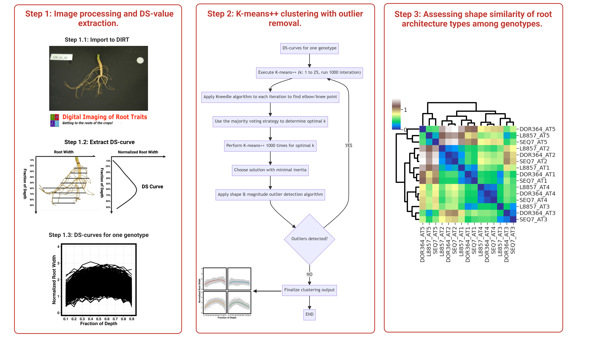

# DIRT-Pop



DIRT-Pop is a robust pipeline tailored for clustering root architecture types. It's specially designed to work with outputs produced by the Digital Image of Root Traits (DIRT) software.

## Prerequisites

Before running DIRT-Pop, ensure the following software are installed:
- [Docker](https://www.docker.com/get-started)
- [Git](https://git-scm.com/)

## Getting Started

### 1. Clone the Repository

Clone the DIRT-Pop repository to your local machine:
```bash
git clone https://github.com/tomatopepper/DIRT-Pop.
```


### 2. Navigate to the Repository Directory

Once cloned, navigate into the repository's directory:
```bash
cd DIRT-Pop
```


### 3. Run DIRT-Pop with Docker

Initiate the DIRT-Pop pipeline using Docker:
```bash
docker run -it -v $(pwd):/opt/DIRT-Pop computationalplantscience/dirtclust bash
```

### 4. Execute the Script

Finally, execute the DIRT-Pop clustering script:
```bash
N_TRIAL_KMEANS=<number_of_clustering_trials> \
N_TRIAL_KNEEDLE=<number_of_kneedle_trials> \
N_CLUSTER=<number_of_clusters> \
INPUT=/opt/DIRT-Pop/DIRTtest.csv \ # your DIRT file 
WORKDIR=/opt/DIRT-Pop ./wrapper.sh
```

Replace the following placeholders with appropriate values:

- `<number_of_clustering_trials>`: Specify the number of clustering iterations (e.g., `25`).
- `<number_of_kneedle_trials>`: Specify the number of kneedle algorithm tests (e.g., `25`).
- `<number_of_clusters>`: Indicate the desired number of clusters (e.g., `25`).
- Note: Modify the `INPUT` path if your DIRT output file is located elsewhere or named differently.


## Contact

For any inquiries or issues, please contact momosan@uga.edu.

## Aknowlegement 

We thank Wes Bonelli for helping create docker environment for DIRT-Pop pipeline.
